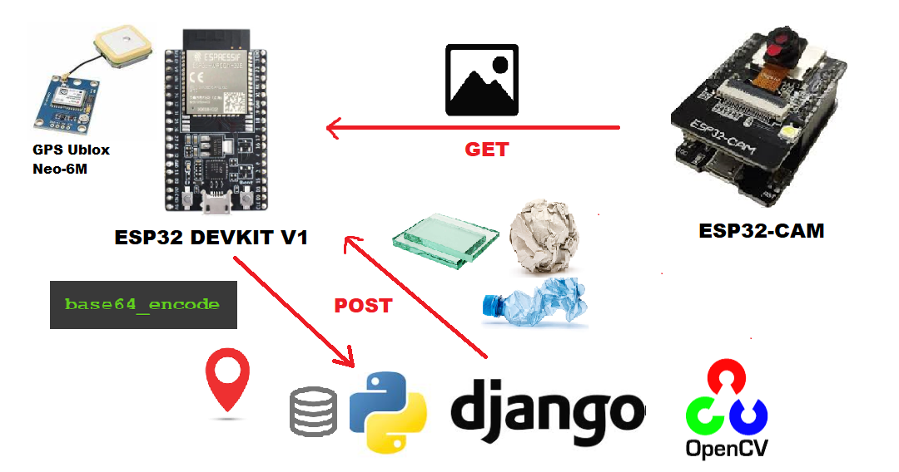

# Smart Tachito
Smart Tachito is an intelligent and digital trash can, using IoT, AI models and digital system knowledge.

## Colaborators
- Jose Luis La Torre Romero (LTprograms)
- Jorge Jesús Quispe Villaverde (Jorgektch)

## Technologies
- Django
- OpenCV
- ESP32 (ArduinoIDE)
- Digital Systems

## Materials for Hardware
- ESP32 DEVKIT v1
- ESP32 CAM
- ESP32 CAM MB
- Miroservo SG90
- GPS Ublox Neo-6M
- HC-SR04
- I2C
- LCD Screen

## Architecture
  
In this architecture, we can see 3 entities:
- ESP32 DEVKIT v1: It works as the controller, is the brain of the system because it makes http requests to the other 2 entities. The way it works is simple, the ultrasonic HC-S404 is always waiting for an object to be detected, once it is detected, ESP32 makes request to ESP32CAM for the image taken. After that, it makes http POST request to the Django server, sending the image decoded in base54, longitude and latitude taken from the GPS module as the request body, the server response is the confidence and the most_confident_label after processing the image using an OpenCV AI model.
- ESP32CAM: It is always turned on waiting for http GET request to send the image captured
- Django server: At the moment, it only has a model (DETECTION). This server has a view which receives an image base64 encoded, longitude and latitud in a json body. First of all, it decodes the image to .jpg, then processes the image to see what it is and ther sends a Json response with confidence and most_confidence_label.